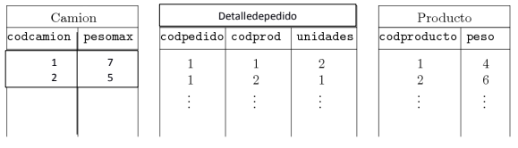

# Proyecto I

Resolver los siguientes puntos

## PUNTO 1.
La empresa de transportes XX envía productos bajo pedido en camiones. Los camiones
soportan un peso máximo y un producto tiene un peso específico.
Sean las tablas:

CREATE TABLE camion(
codcamion NUMBER(8) PRIMARY KEY,
pesomax NUMBER(8) NOT NULL CHECK (pesomax > 0)
);
CREATE TABLE producto(
codproducto NUMBER(8) PRIMARY KEY,
peso NUMBER(8) NOT NULL CHECK (peso > 0)
);
CREATE TABLE detalledepedido(
codpedido NUMBER(8),
codprod NUMBER(8) REFERENCES producto,
unidades NUMBER(8) NOT NULL CHECK (unidades > 0),
PRIMARY KEY (codpedido, codprod)
);

### Punto 1.1
Desarrollar triggers (de inserción, actualización y borrado) que garanticen que ningún 
producto tenga un peso mayor que el camión que soporta mayor peso.
Ejemplos: suponga que el camión que más peso soporta es 100 (kilos por ejemplo). Si se
intenta ingresar un producto con peso 103 se debe rechazar. Suponga que el producto más
pesado (actualmente en la tabla producto) es de 90 kilos, si se le actualiza el peso a 95, se
debe aceptar pero si se le sube el peso a 101 se debe rechazar. En este mismo ejemplo, si
se le baja el peso al camión a 99 se debe aceptar pero si se baja, por ejemplo, a 80 se debe
rechazar la operación (a menos que haya otro camión que soporte más de 90 kilos). En
cuanto al borrado, si se borra en la tabla Camion, la operación se debe aceptar siempre y
cuando quede al menos un camión que supere en peso al producto más pesado.

### Punto 1.2
Realizar un programa en PL/SQL que reciba como parámetro el código de un
pedido. El procedimiento debe retornar la distribución de productos en cada camión,
cumpliendo que cada camión debe ir lo más cargado posible (en cuanto al peso que este
soporta) según los productos y las cantidades (unidades) en la tabla detalledepedido. El
llenado de los camiones se hace de forma secuencial (uno por uno) y de manera
descendente por peso, para cada viaje requerido, llenando primero los camiones que
soporten más peso.

  

Ejemplo: para el pedido 1 que tiene dos detalles. Suponga que solo hay dos camiones (los
mostrados en la tabla camión).
En el primer viaje:
- el camión con código 1 (el que soporta más peso) debe ir cargado con una unidad
del producto con código 2, es decir, la de peso 6, puesto que es el que maximiza la
carga del camión sin excederla. (Si en el pedido 1 hubiera un producto de peso 1,
entonces este camión llevaría dos productos en este viaje: el de peso 6 y uno de
peso 1).
- el camión 2 va cargado con una unidad del producto 1.
En el segundo viaje:
- se debe tomar de nuevo el camión que más peso soporta (el camión 1)y se carga
con la unidad que faltaba por llevar del producto 1.
El programa debe imprimir entonces todos los viajes requeridos para satisfacer el pedido,
se debe mostrar en cada viaje, cada camión cuantos y que productos lleva.